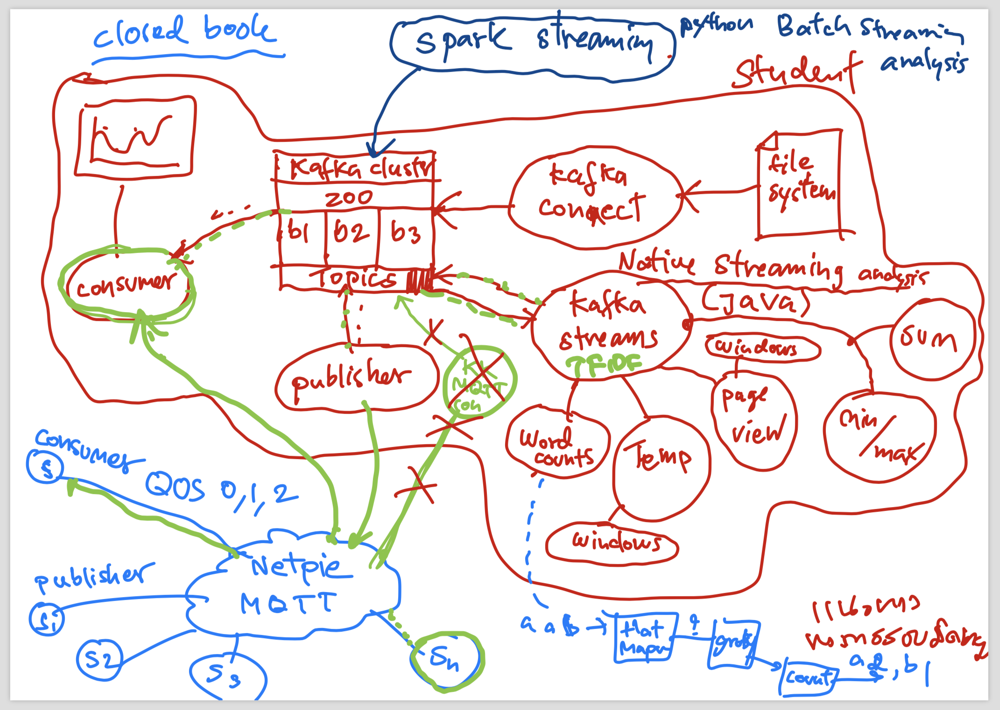

**Week6 (Outline)** :hot_face:::hurtrealbad::hurtrealbad::hurtrealbad::hurtrealbad::hurtrealbad::hurtrealbad::hurtrealbad::hurtrealbad:

6.1 What you've learned so far.


6.2 Spark streaming
https://spark.apache.org/docs/latest/streaming-programming-guide.html

6.3 Mobile sensors and user behaviors
Mobile-sensor.pdf

6.4 Exercise

**Setup Spark**
1. Install java (version 8)
2. Install python
3. Download spark https://downloads.apache.org/spark/spark-2.4.7/spark-2.4.7-bin-hadoop2.6.tgz
4. Setup spark home SPARK_HOME=C:\spark-2.4.7-bin-hadoop2.6\
5. Test run "pyspark"

For window only

6. Create a hadoop\bin folder inside the SPARK_HOME folder

7. Download http://github.com/steveloughran/winutils/raw/master/hadoop-2.6.0/bin/winutils.exe to hadoop\bin

8. Setup hadoop home HADOOP_HOME=%SPARK_HOME%\hadoop

**To run program (Wordcount)**

0. pip install findspark
1. Start a kafker cluster (zoo + brokers)
2. Create a topic 
~~3. Run spark with the following commandline: spark-submit --packages org.apache.spark:spark-streaming-kafka-0-8_2.11:2.3.0 kafka_spark_demo.py~~

3. Download the "spark-streaming-kafka-0-8-assembly_2.11-2.4.7.jar" file from https://mvnrepository.com/artifact/org.apache.spark/spark-streaming-kafka-0-8-assembly_2.11/2.4.7 or from this github to drive C:\
4. :+1: Run the following command 
```
spark-submit --jars C:\spark-streaming-kafka-0-8-assembly_2.11-2.4.7.jar kafka_spark_demo.py
```
in C:\Users\STD User\kafka-quickstart-workshop-main\Week6>

5. Run a producer to generate a list of words

*Note*

Must use python 3.7 and Java 8


